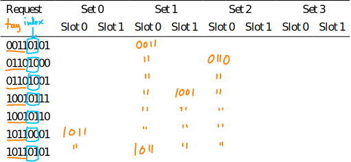

# Exam 2 practice questions — solutions

## A: x86-64

A1)

Consider the following C function prototype:

```c
void str_tolower(char *s);
```

The `str_tolower` function modifies a C character string so that each
upper case letter is converted to lower case.

Show an x86-64 assembly language implementation of this function.
Note that the ASCII codes for upper case letters are in the range
65–90, and the ASCII codes for lower case letters are the range
97–122.  Characters that aren't letters should not be modified.

*Possible answer*:

```
	.globl str_tolower
str_tolower:
	subq $8, %rsp

.Lstr_tolower_loop:
	movb (%rdi), %al
	cmpb $0, %al
	je .Lstr_tolower_done

	cmpb $65, %al
	jb .Lstr_tolower_loop_continue
	cmpb $90, %al
	ja .Lstr_tolower_loop_continue

	addb $(97 - 65), %al
	movb %al, (%rdi)

.Lstr_tolower_loop_continue:
	incq %rdi
	jmp .Lstr_tolower_loop

.Lstr_tolower_done:
	addq $8, %rsp
	ret
```

## B: Code optimization, performance

B1)

Consider the following function:

```c
// combine a collection of strings into a single string
char *combine(const char *strings[], unsigned num_strings) {
  // determine amount of space needed
  size_t total_size = 0;
  for (unsigned i = 0; i < num_strings; i++) {
    total_size += strlen(strings[i]);
  }

  // allocate buffer large enough for all strings
  char *result = malloc(total_size + 1);

  // copy the data into the buffer
  result[0] = '\0';
  for (unsigned i = 0; i < num_strings; i++) {
    strcat(result, strings[i]);
  }

  return result;
}
```

Explain the performance problem with this function and how to fix it.

*Possible answer*:

The problem is potential O(N<sup>2</sup>) running time when a large number of
small strings are combined.  The problem is that `strcat` repeatedly has to look
for the NUL terminator in the `result` buffer, an O(N) operation which
is called in a loop.

This can be fixed by keeping track of where the NUL terminator in the result buffer
is.  For example:

```c
// combine a collection of strings into a single string
char *combine(const char *strings[], unsigned num_strings) {
  // determine amount of space needed
  size_t total_size = 0;
  for (unsigned i = 0; i < num_strings; i++) {
    total_size += strlen(strings[i]);
  }

  // allocate buffer large enough for all strings
  char *result = malloc(total_size + 1);

  // copy the data into the buffer
  char *dest = result;
  for (unsigned i = 0; i < num_strings; i++) {
    for (unsigned j = 0; strings[i][j] != '\0'; j++) {
      *dest = strings[i][j];
      dest++;
    }
  }

  // add final NUL terminator
  *dest = '\0';

  return result;
}
```

B2)

Consider the following C code (assume that all variables have the type
`uint64_t`):

```c
a = b * c;
d = e * f;
g = h * i;
j = a * d * g;
```

Assume that

* the CPU is superscalar
* all of the variables refer to CPU registers
* the CPU has two integer multipliers, each of which is fully pipelined
* a single multiplication requires 3 cycles

What is the mininum number of cycles required for the computation to complete?
Justify your answer.

*Possible answer*:

The multiplications computing `a`, `d`, and `g` are independent.
The multiplication computing `j` is dependent on all three of the
earlier mulitplications, and itself requires two multiplications with
a data dependency.

Rewriting the code slightly to introduce a temporary to make the
data dependence in the computation of j explicit, we have:

```c
a = b * c;
d = e * f;
g = h * i;
t = a * d;
j = t * g;
```

Given two integer multipliers with 3 stage pipelines,
utilization could look like this:

```
   Time:   0    1    2    3    4    5    6    7    8    9   
          -------------------------------------------------
        / b*c  h*i       a*d            t*g           [result]
Unit 1 |       b*c  h*i       a*d            t*g
        \           b*c  h*i       a*d            t*g
        / e*f
Unit 2 |       e*f
        \           e*f
```

Thus, it is possible to complete the computation in 9 cycles, if
the `b*c` and `e*f` multiplications both start on cycle 0.

## C: Caches

C1)

Assume a system with 32 bit addresses has a direct mapped cache with 256 KB 
total capacity (2<sup>18</sup> bytes) and a 32 byte block size.
Show the format of an address, indicating which bits are offset, index, and tag.

*Answer*:

32 = 2<sup>5</sup>, so 5 offset bits

Number of blocks in the cache is 2<sup>18</sup> / 2<sup>5</sup> = 2<sup>13</sup>, so 13 index bits

32 - 13 - 5 = 14, so 14 tag bits

Thus,

Tag     | Index   | Offset
------- | ------- | ------
14 bits | 13 bits | 5 bits

C2)

Assume a system with 32 bit addresses has a 4-way set associative cache
with 512 KB total capacity (2<sup>19</sup> bytes) and a 64 byte block size.
Show the format of an address, indicating which bits are offset, index, and tag.

*Answer*:

64 = 2<sup>6</sup>, so 6 offset bits

Number of blocks in the cache is 2<sup>19</sup> / 2<sup>6</sup> = 2<sup>13</sup>

With 4 = 2<sup>2</sup> blocks per set, number of sets is 2<sup>13</sup> / 2<sup>2</sup> = 2<sup>11</sup>, so 11 index bits

32 - 11 - 6 = 15, so 15 tag bits

Thus,

Tag     | Index   | Offset
------- | ------- | ------
15 bits | 11 bits | 6 bits

C3)

Assume a system with 32 bit addresses and a fully associative cache with 512 KB
total capacity (2<sup>19</sup> bytes) and a 64 byte block size.
Show the format of an address, indicating which bits are offset, index, and tag.

*Answer*:

64 = 2<sup>6</sup>, so 6 offset bits

Since it's fully associative, there are no index bits, so the number of tag bits is 32 - 6 = 26

Thus,

Tag     |  Offset
------- |  ------
26 bits |  6 bits

C4)

Consider use of a 2-way associative cache that addresses blocks of 4 bytes,
with 4 sets in a 8-bit address space.

(a) How are the 8 bits of the address used as tag, index, and offset for the cache?

*Answer*:

Blocks are 4 = 2<sup>2</sup> bytes, so 2 offset bits

There are 4 = 2<sup>2</sup> sets, so 2 index bits

Remaining 4 bits are tag

Thus,

Tag    | Index  | Offset
------ | ------ | ------
4 bits | 2 bits | 2 bits

(b) Consider a following sequence of requests to the cache.
Enter the tag for each cache slot after each request in the table below. Assume FIFO as
caching strategy (do not worry about internal bookkeeping of timestamps). Note: use &#34;
to indicate that the value in the slot is identical to the previous value.

<table>
  <tr>
   <td>Request</td>
   <td colspan="2" style="text-align: center;">Set 0</td>
   <td colspan="2" style="text-align: center;">Set 1</td>
   <td colspan="2" style="text-align: center;">Set 2</td>
   <td colspan="2" style="text-align: center;">Set 3</td>
  </tr>

  <tr style="border-bottom: 1px solid;">
   <td></td>
   <td>Slot 0</td>
   <td>Slot 1</td>
   <td>Slot 0</td>
   <td>Slot 1</td>
   <td>Slot 0</td>
   <td>Slot 1</td>
   <td>Slot 0</td>
   <td>Slot 1</td>
  </tr>

  <tr><td>00110101</td><td></td><td></td><td></td><td></td><td></td><td></td><td></td><td></td></tr>
  <tr><td>01101000</td><td></td><td></td><td></td><td></td><td></td><td></td><td></td><td></td></tr>
  <tr><td>01101001</td><td></td><td></td><td></td><td></td><td></td><td></td><td></td><td></td></tr>
  <tr><td>10010111</td><td></td><td></td><td></td><td></td><td></td><td></td><td></td><td></td></tr>
  <tr><td>10010110</td><td></td><td></td><td></td><td></td><td></td><td></td><td></td><td></td></tr>
  <tr><td>10110001</td><td></td><td></td><td></td><td></td><td></td><td></td><td></td><td></td></tr>
  <tr><td>10110101</td><td></td><td></td><td></td><td></td><td></td><td></td><td></td><td></td></tr>
</table>

*Answer*:

<div style="margin-left: 2em;">
  
</div>
